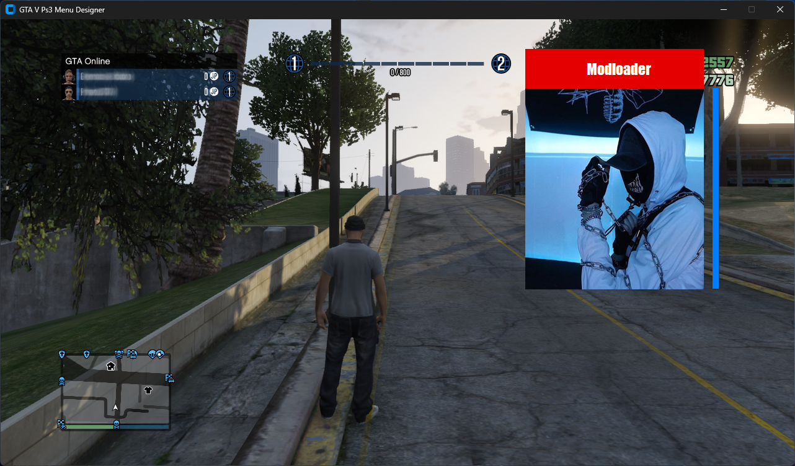

# GTAV PS3 Menu Designer

## Descrição

O **GTAV PS3 Menu Designer** é uma ferramenta desenvolvida em Python que simula a interface do GTA V para PS3. Esta ferramenta é projetada para auxiliar na criação e design de Mod Menus, facilitando o processo de desenvolvimento e testes.

## Versão

**1.0.3**

## Tecnologias Utilizadas

Este projeto foi desenvolvido utilizando a biblioteca [CustomTkinter](https://customtkinter.tomschimansky.com/), uma versão personalizada do Tkinter que permite criar interfaces de usuário mais modernas e atraentes.

## Funcionalidade

A ideia principal do GTAV PS3 Menu Designer é permitir que os usuários criem e ajustem elementos de design para seus Mod Menus sem a necessidade de testes constantes dentro do jogo. Por exemplo, se o usuário deseja criar um novo retângulo (RECT) para seu menu, ele pode utilizar a função `DRAW_RECT`, que simula a criação de elementos no Mod Menu.

Os usuários podem trabalhar com coordenadas e tamanhos de forma intuitiva, tornando o processo de design mais eficiente. Quando estiverem satisfeitos com o design, eles podem facilmente transferir os valores ajustados para a base do Mod Menu do jogo.